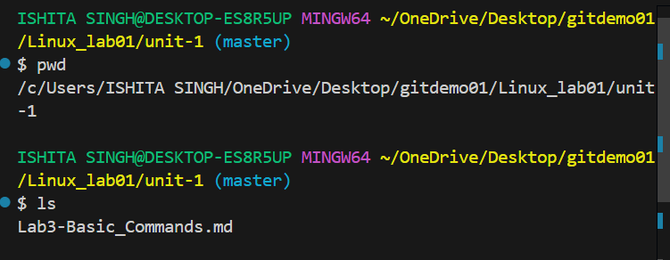
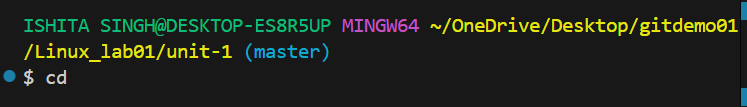
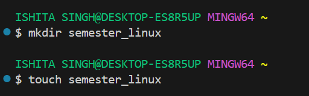
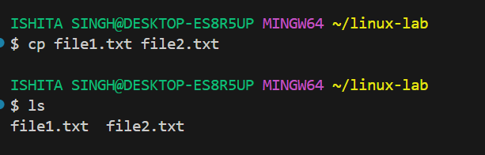
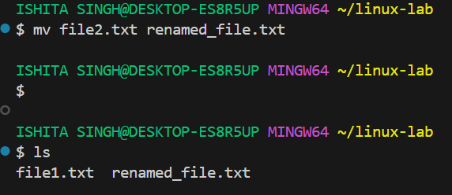
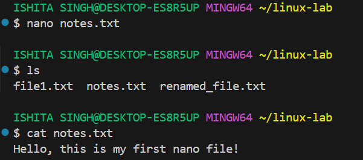
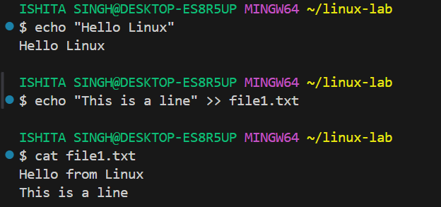

# Linux Basic Commands
## ✅ 1. Navigation Commands
- pwd – Print Working Directory
Shows the current location in the filesystem.
```bash
pwd
```

- ls – List Directory Contents
Lists files and folders in the current directory.
```bash
ls
```
* ls -l → Detailed list (permissions, size, date)
* ls -a → Shows hidden files (those starting with .)
* ls -la → Combined

- cd – Change Directory
Moves into a directory.
```bash
cd folder_name
```
Examples:
```bash
cd Documents        # Go to Documents
cd ..               # Go up one level
cd /                # Go to root
cd ~                # Go to home directory
```

## ✅ 2. File and Directory Management
mkdir – Make Directory
Creates a new folder.
```bash
mkdir new_folder
```

- touch – Create File
Creates an empty file.
```bash
touch file.txt
```
- cp – Copy Files or Directories
```bash
cp source.txt destination.txt
```
Copy folder:
```bash
cp -r folder1 folder2
```

- mv – Move or Rename Files
```bash
mv oldname.txt newname.txt
mv file.txt ~/Documents/     # Move file
```

- rm – Remove Files
```bash
rm file.txt          # Delete file
rm -r folder_name    # Delete folder (recursively)
```

⚠️ Be careful! There is no undo.

## ✅ 3. File Viewing & Editing
### cat – View File Contents
Displays content in terminal.
```bash
cat file.txt
```

### nano – Edit Files in Terminal
A basic terminal-based text editor.
```bash
nano file.txt
```

Use arrows to move
CTRL + O to save
CTRL + X to exit
clear – Clears the Terminal
clear
Shortcut: CTRL + L

## ✅ 4. System Commands
echo – Print Text
Useful for debugging or scripting.
```bash
echo "Hello, World!"
```

`whoami` – Show Current User
```bash
whoami
```
`man` – Manual for Any Command
```bash
man ls
```

Use q to quit the manual.

## ✅ 5. Searching and Finding
### find – Locate Files
```bash
find . -name "*.txt"
```
🔍 Finds all .txt files in current folder and subfolders.

### grep – Search Inside Files
```bash
grep "hello" file.txt
```
🔍 Searches for the word hello inside file.txt.

### ✅ 6. Helpful Shortcuts
Shortcut	Action
Tab	Auto-complete files/folders
↑ / ↓	Browse command history
CTRL + C	Stop a running command
CTRL + L	Clear screen
### ✅ 7. Bonus: Chaining Commands
Run multiple commands:
```bash
mkdir test && cd test && touch hello.txt
```
Run only if previous command succeeds: `&&`
Run regardless of success: `;`
