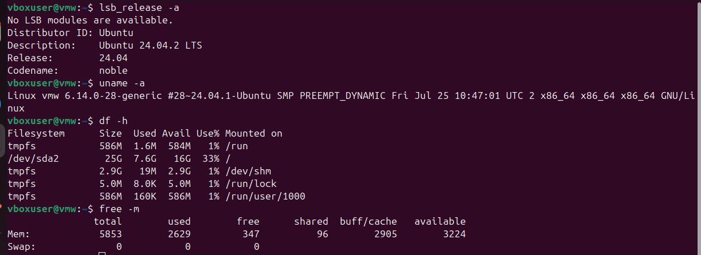

# LAB 1 : INSTALL VIRTUAL PLAYER AND LINUX
## WHAT IS LINUX ?

Linux is an open-source operating system kernel that serves as the foundation for
various operating systems, commonly referred to as Linux distributions (or
distros). Developed by Linus Torvalds in 1991, Linux is known for its stability,
security, and versatility, making it popular for servers, desktops, embedded
systems, and more.

### STEP 1 : DOWNLOAD VIRTUALBOX FILE .

1 Go to the VirtualBox Website
2 select your operating system

### STEP 2 : INSTALLING VIRTUAL BOX
#### 1 The beginning

#### 2 select installation location

#### 3 ready to install

#### 4 installation complete

#### 5 opening virtualbox

### STEP 3 : INSTALLING LINUX USING VIRTUALBOX
#### 1 Naming virtual machine
After installing virtual box ,click New .
– Write the Name you want for your system, for example: Linux Mint
– Select Type: Linux.
– Select Version: Ubuntu

#### 2 select the amount of ram

#### 3 Hard Disk setting
Select hard disk setting:
– Choose ‘Create a virtual hard drive Now’, in order to make a virtual disk space.
– Select the amount of hard drive size.
-now you are done with hardware settings.
    

#### 4 Launching your System
Choose the downloaded Linux ISO file:
– Click Start to launch your system

choose your iso file from your computer

#### 5 Final installation
Install Linux
– Click Install Ubuntu:

## Running commands in ubuntu
Once installed, run the following commands in Ubuntu terminal and save outputs:

* lsb_release -a (shows Ubuntu version)
* uname -a (kernel info)
* df -h (disk usage)
* free -m (memory usage)

### what are two advantages of installing ubuntu in virtual box?
1. No risk to your main system
2. Easier to manage and reset

### what are two advantages of dual booting instead of using a vm?
1. Better performance
2. Full hardware compatibility