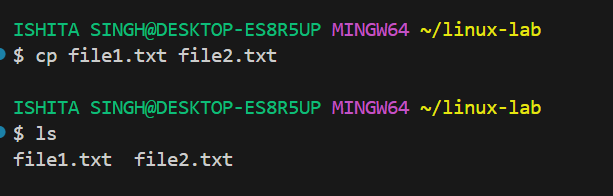
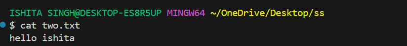

# Linux Basic Commands
## ✅ 1. Navigation Commands
- pwd – Print Working Directory
Shows the current location in the filesystem.
```bash
pwd
```

- ls – List Directory Contents
Lists files and folders in the current directory.
```bash
ls
```
* ls -l → Detailed list (permissions, size, date)
* ls -a → Shows hidden files (those starting with .)
* ls -la → Combined

- cd – Change Directory
Moves into a directory.
```bash
cd folder_name
```
Examples:
```bash
cd Documents        # Go to Documents
cd ..               # Go up one level
cd /                # Go to root
cd ~                # Go to home directory
```

## ✅ 2. File and Directory Management
mkdir – Make Directory
Creates a new folder.
```bash
mkdir new_folder
```

- touch – Create File
Creates an empty file.
```bash
touch file.txt
```
- cp – Copy Files or Directories
```bash
cp source.txt destination.txt
```
Copy folder:
```bash
cp -r folder1 folder2
```

- mv – Move or Rename Files
```bash
mv oldname.txt newname.txt
mv file.txt ~/Documents/     # Move file
```

- rm – Remove Files
```bash
rm file.txt          # Delete file
rm -r folder_name    # Delete folder (recursively)
```

⚠️ Be careful! There is no undo.

## ✅ 3. File Viewing & Editing
### cat – View File Contents
Displays content in terminal.
```bash
cat file.txt
```

### nano – Edit Files in Terminal
A basic terminal-based text editor.
```bash
nano file.txt
```

Use arrows to move
CTRL + O to save
CTRL + X to exit
clear – Clears the Terminal
clear
Shortcut: CTRL + L

## ✅ 4. System Commands
echo – Print Text
Useful for debugging or scripting.
```bash
echo "Hello, World!"
```

`whoami` – Show Current User
```bash
whoami
```
`man` – Manual for Any Command
```bash
man ls
```

Use q to quit the manual.

## ✅ 5. Searching and Finding
### find – Locate Files
```bash
find . -name "*.txt"
```
🔍 Finds all .txt files in current folder and subfolders.

### grep – Search Inside Files
```bash
grep "hello" file.txt
```
🔍 Searches for the word hello inside file.txt.

### ✅ 6. Helpful Shortcuts
Shortcut	Action
Tab	Auto-complete files/folders
↑ / ↓	Browse command history
CTRL + C	Stop a running command
CTRL + L	Clear screen
### ✅ 7. Bonus: Chaining Commands
Run multiple commands:
```bash
mkdir test && cd test && touch hello.txt
```
Run only if previous command succeeds: `&&`
Run regardless of success: `;`

# Advanced Linux File Commands

## **1. File Manipulation Commands**

### **`touch`** – Create or Update File Timestamps

```bash
# Create an empty file
touch file1.txt

# Update timestamp of an existing file
touch existing.txt

# Create multiple files at once
touch file2.txt file3.txt
```


---

### **`cp`** – Copy Files and Directories

```bash
# Copy a file
cp source.txt destination.txt

# Copy to another directory
cp source.txt /path/to/destination/

# Copy directory recursively
cp -r dir1 dir2

# Preserve file attributes (timestamps, permissions)
cp -p source.txt backup.txt
```


---

### **`mv`** – Move or Rename Files

```bash
# Rename a file
mv oldname.txt newname.txt

# Move file to another directory
mv file.txt /path/to/destination/

# Move and overwrite without prompt
mv -f file.txt /destination/
```


---

### **`rm`** – Remove Files and Directories

```bash
# Remove a file
rm file.txt

# Remove multiple files
rm file1.txt file2.txt

# Remove a directory recursively
rm -r foldername/

# Force remove without prompt
rm -rf foldername/
```


---

### **`cat`** – View or Concatenate Files

```bash
# Display file contents
cat file.txt

# Combine multiple files into one
cat file1.txt file2.txt > combined.txt

# Display file with line numbers
cat -n file.txt
```

---

### **`less`** – View File One Page at a Time

```bash
less file.txt
# Navigation inside less:
# Space → next page
# b → previous page
# q → quit
```

---

### **`head`** – Show First Lines of a File

```bash
# First 10 lines (default)
head file.txt

# First 20 lines
head -n 20 file.txt
```

---

### **`tail`** – Show Last Lines of a File

```bash
# Last 10 lines (default)
tail file.txt

# Last 15 lines
tail -n 15 file.txt

# Monitor file changes in real-time
tail -f logfile.txt
```

---

## **2. File Permissions and Ownership**

### **`ls -l`** – View Detailed File Info

```bash
ls -l
# Example output:
# -rw-r--r-- 1 user group 1024 Aug 14 10:00 file.txt
# Breakdown:
# [1] -rw-r--r-- → Permissions
# [2] 1 → Hard link count
# [3] user → Owner
# [4] group → Group owner
# [5] 1024 → File size (bytes)
# [6] Aug 14 10:00 → Last modified date/time
# [7] file.txt → File name
```

---

### **File Permission Structure**

* **Owner (u)** – File creator
* **Group (g)** – Users in same group
* **Others (o)** – Everyone else
  Permissions: **r (read)**, **w (write)**, **x (execute)**

---

### **`chmod`** – Change File Permissions

```bash
# Symbolic method
chmod u+x file.sh   # Add execute for owner
chmod g-w file.txt  # Remove write for group
chmod o+r file.txt  # Add read for others

# Numeric method (r=4, w=2, x=1)
chmod 755 file.sh   # rwxr-xr-x
chmod 644 file.txt  # rw-r--r--
```


---

### **`chown`** – Change File Owner

```bash
# Change owner
sudo chown newuser file.txt

# Change owner and group
sudo chown newuser:newgroup file.txt
```

---

### **`chgrp`** – Change Group

```bash
sudo chgrp developers file.txt
```

---

## **3. Advanced File and Directory Operations**

### **`find`** – Search for Files

```bash
# Find by name
find /path -name "file.txt"

# Find by extension
find /path -name "*.log"

# Find by size (>100MB)
find /path -size +100M

# Find and delete
find /path -name "*.tmp" -delete
```

---

### **`grep`** – Search Text in Files

```bash
# Search a pattern
grep "error" logfile.txt

# Case-insensitive search
grep -i "error" logfile.txt

# Recursive search in directory
grep -r "TODO" /project/

# Show line numbers
grep -n "warning" logfile.txt
```

---

### **`tar`** – Archive Files

```bash
# Create archive
tar -cvf archive.tar file1 file2 dir/

# Extract archive
tar -xvf archive.tar

# View archive contents
tar -tvf archive.tar
```

---

### **`gzip` / `gunzip`** – Compress & Decompress

```bash
# Compress
gzip file.txt  # Creates file.txt.gz

# Decompress
gunzip file.txt.gz
```

---

### **`ln`** – Create Links

```bash
# Hard link
ln original.txt hardlink.txt

# Symbolic (soft) link
ln -s /path/to/original symlinkname
```

---
