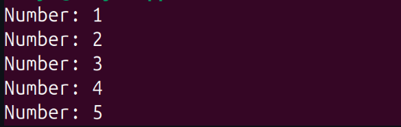
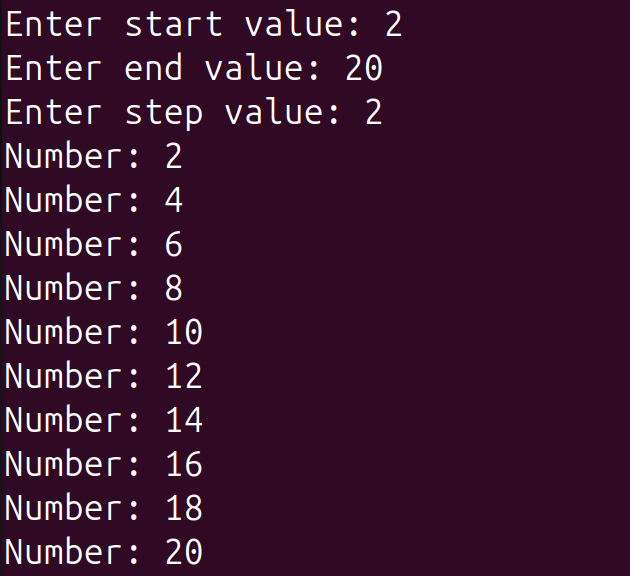

# LAB-3 MODIFYING AN EXISTING SCRIPT
## Script Chosen
`print_numbers.sh`
---
### 🟨 Original Code
```bash
#!/bin/bash

for i in 1 2 3 4 5
do
  echo "Number: $i"
done
```
### 🟨 Original Output


## 📝 Modifying Script
Modify script so that:

* User provides start, end, and step values as input.

* Script validates inputs (e.g., step must be positive).

### 🟨 New Code
```bash
#!/bin/bash

# Ask for user input
read -p "Enter start value: " start
read -p "Enter end value: " end
read -p "Enter step value: " step

# Validate that step is positive
if [ "$step" -le 0 ]; then
  echo "Error: Step must be a positive number."
  exit 1
fi

# Print numbers in the given range
for (( i=start; i<=end; i+=step ))
do
  echo "Number: $i"
done
```
### 🟨 New Output

---

## 👉🏻 Major differences between both the codes
### 1️⃣ First Code
* The numbers are hardcoded:` 1 2 3 4 5`.

* Always prints the same 5 numbers.

* No user input.

* No validation.

* Loop type: `for i in list` → iterates over a fixed list of values.

### 2️⃣ Second Code
* **Dynamic input**: User enters `start`, `end`, and `step`.

* Validation: If step ≤ 0, script exits with error (`exit 1`).

* Flexible range: Can print any sequence depending on input.

* Loop type: `for (( expr ))` → a C-style for loop (works like in C language).

- It initializes `i=start`.

- Runs until `i<=end`.

- Increments `i` by `step`.
---

## ExtraQuestions
### 1️⃣ Difference between $1, $@, and $# in bash?

1. `$1`

Refers to the first positional argument passed to the script.

`$2` = second argument, `$3` = third, etc.

Example:
```bash
#!/bin/bash
echo "First arg: $1"
```

Run:
```bash
./script.sh hello world
```


Output:
```bash
First arg: hello
```

2. `$@`

Expands to all arguments passed to the script, as separate words.

Useful when you want to loop over all arguments.
```bash
#!/bin/bash
for arg in "$@"
do
  echo "Arg: $arg"
done
```


Run:
```bash
./script.sh red green blue
```

Output:
```bash
Arg: red
Arg: green
Arg: blue
```

👉 Quotes ("$@") are important:

`"$@"` → keeps each argument separate (safe).

`$@` (unquoted) → word splitting may occur.

3. `$#`

Represents the number of arguments passed to the script.
```bash
#!/bin/bash
echo "Number of arguments: $#"

```
Run:
```bash
./script.sh a b c
```

Output:
```bash
Number of arguments: 3
```

### 2️⃣ What does exit 1 mean in a script?
In a script (like a bash script),

`exit 1` means:

* Exit the script immediately (stop execution).

* Return status code 1 to the shell (or calling process).